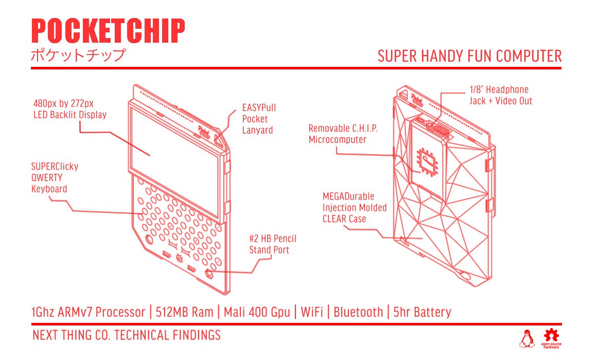

## POCKETCHIP CONFIGURATION FOR TEXTMODE

***

> My very own configuration for PocketChip microcomputer. Be free to use, share or fork it

### Includes

* Full keyboard support with Fn key combinations working
* Support for rt2800usb based wifi adapters
* Battery level in tmux status line
* Python development axed vimrc
* Custom MOTD
* And more ... :)

### Installation

1. Flash your C.H.I.P. with the latest headless image from NTC at <https://flash.getchip.com/>

2. Install Git

` sudo apt-get install git-core `

3. Clone the repo

` git clone https://github.com/totor59/pocketchip.git `

4. Go inside pocketchip/

` cd pocketchip `

5. Login as root

` su ` 

6. Make install.sh executable and run it

` chmod +x install.sh && ./install.sh `

7. Reboot and enjoy !  

### Todo

* bashrc chip & root
* mutt config
